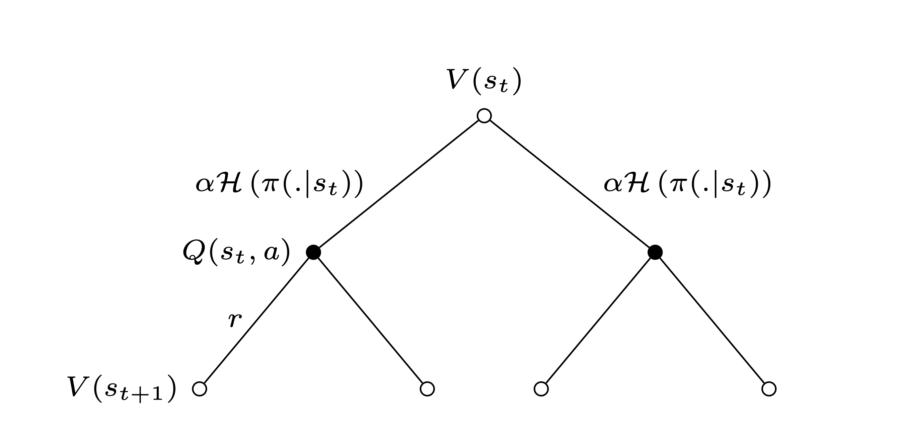
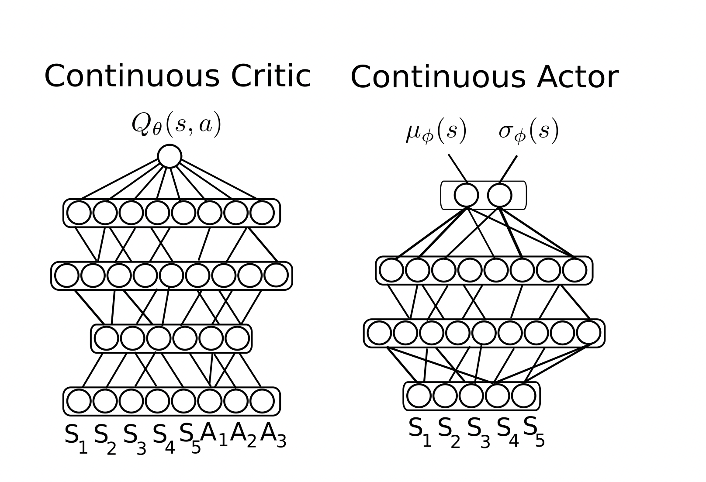
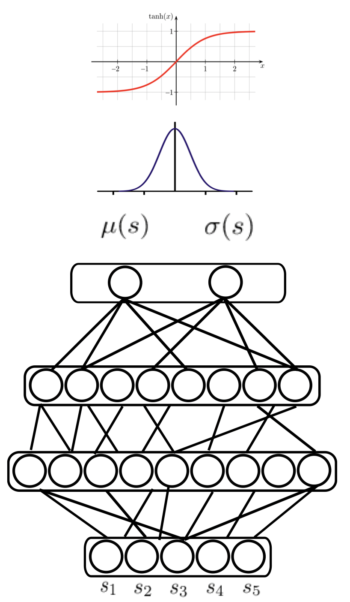

# <u> Soft actor critic </u>

## General concept

- one stochastic actor $\pi(s)$
- one or two Q-value critics $Q_i(S,A)$
- target Q-value critics $Q_ti(S,A)$

The SAC agent maintains these function approximators

SAC parameterizes a policy a policy $\pi_{\phi}$ and a soft Q-value function $Q_{\theta}$

-----

## Exploration trough Entropy regularization
- soft means entropy regularized
- can use replay buffer -> improve sample efficiency
- adds entropy regularization to favor exploration
- more entropy means larger choice of actions, avoids collapsing to determinism
- by removing all stochasticity from _SAC_, we get kind of TD3
-----

## A litte bit of math

_SAC_ learns a stochastic policy $\pi^*$ maximising both rewards and entropy such that:

$[ \pi^* = \arg\max \sum{E_{(s_t, a_t) \sim \rho_{\pi}}} [r(s_t, a_t) + \alpha H(\pi(\cdot | s_t))] ]$  

This basically means: the optimal policy will be the best policy that maximizes this term, where the sum over all time stemps of the expettion of each state aciton pair provided by the current policy where ypu sum reward for the action state pair  plus some entropy term

The entropy is defined as: $ H(\pi(\cdot | s_t)) = \mathbb{E}_{a \sim \pi(\cdot | s)} [-\log(\pi(a | s))] $ 

Expectation of some aciton given the current policy, whereas the expectation is mionus the log of the prob of taking the action given the policy, so for each action it will tell you the probability to take this action

We can define our Value function as:

$$ V(s_t) = \mathbb{E}_{a \sim \pi_{\phi}(\cdot | s_t)} [Q_{\theta}(s_t, a) - \alpha \log(\pi_{\phi}(a | s_t))] $$ 
(for more info, see https://www.youtube.com/watch?v=_nFXOZpo50U)  

Now, we do some magic with the Bellman operator.

This is the standard thing that we know: $$ T^{\pi_{\phi}}[Q_{\theta}(s_t, a_t)] = r + \gamma V_{\theta}(s_{t+1}) $$
Here, this weird as looking $ T $ just stands for the bellman operator. From the previous equation we can rewrite this as:

$$ T^{\pi_{\phi}}[Q_{\theta}(s_t, a_t)] = r + \gamma \mathbb{E}_{a \sim \pi_{\phi}(\cdot | s_{t+1})} [Q_{\theta}(s_{t+1}, a) - \alpha \log(\pi_{\phi}(a|s_{t+1}))] $$ 

-----
## SAC critic updates

- given the specific bellman operator
- minimization of temporal difference error
- policy evaluation step

$$ J_Q(\theta) = \mathbb{E}_{(s_t, a_t, s_{t+1}) \sim D} [(Q_{\theta}(s_t, a_t) - (r(s_t, a_t) + \gamma V_{\theta}(s_{t+1})))^2] $$ 

where 
$$ V_{\theta}(s_{t+1}) = \mathbb{E}_{a \sim \pi_{\phi}(\cdot | s_{t+1})} [Q_{\theta}(s_{t+1}, a) - \alpha \log(\pi_{\phi}(a|s_{t+1}))] $$

We try to minimze the expcectation over transitions of this temporal difference rror squared. The q-value gets optimal when this converges to zero, to this is a good proxy for a loss function that we want to miniomize using neural networks. This all defines the loss function on the critic network, once we computed this we can apply that term to our network using stochastic gradient techniques on our network 

-> I will optimize my ciritc

----
## SAC actor updates

- Update policy such as to become greedy w.r.t to the soft Q-value. I want to update my ploicy so that it is optimal w.r.t my critic, i want to choose actions that give high q(s,a) values
- Choice: update the policy towards the exponential of the soft Q-value

$$  J_{\pi}(\phi) = \mathbb{E}_{s_t \sim D} [\text{KL}(\pi_{\phi}(\cdot|s_t)) || {\exp(\alpha Q_{\theta}(s_t, \cdot)) \over Z_{\theta}(s_t)}] $$
If we use that with that divide thing, the high q values will be vbery high and the lows will be very low. We try to minimize the klublakliber divergenc ebetween our plicy and contrasted values. KL divergence needs standard distributions
- $ Z_θ(s_t) $ is just a normalizing term to have a distribution
- We do not minimize directly this expression but a surrogate one that has the same gradient w.r.t φ
- This is the policy improvement step
The policy parameters can be learned by minimizing:
$$ J_{\pi}(\phi) = \mathbb{E}_{s \sim D} \mathbb{E}_{a \sim \pi_{\phi}(\cdot|s)} [\alpha \log \pi_{\phi}(a|s) - Q_{\theta}(s, a)]  $$

Loss funciton is the expectation over the states in our replay buffer of another expectation of the actions our polic will take 

----

## Network architectures

- The critic takes a state and an action vector and returns a scalar Q-value
- needs to choose a distribution parameterisation for the actor
- SAC uses a squashed Gaussian: $ a = \tanh(n) $ where n is $ \quad n \sim \mathcal{N}(\mu_{\phi}, \sigma_{\phi}) $
- $ \text{Actor returns } \mu_{\phi} \text{ and } \sigma_{\phi} $

-----

## Squashed Gaussian distribution

- Multivariate Gaussians support is non finite whereas aciton spaces have finite supports (most of the time $[-1,1]^n$)
- Idea: sample according to a Gaussian and rescale the sampled action
- Need for the rescaling operation to be differentiable: hence $\tanh$

-> The random variable obtained when "squashing" a Gaussian with a tanh function has a new density distribution, but unfortuntely, tensor libraries dont provide the estimation from squashed Gaussians - look in sample code
 
 
 
 

We have the actor, get mu sigma , apply guasssian and then hyperbolic tangent
Gaussian can give you very extreme values with low probailites, wheras in many envrionments you have more limited stuff. So we rescale it and thats why we use tanh, the infinite values puts it back in the interval -1,1

-----

## Reparameterization trick (used for sampling)

This is mathematically a little bit tricky, here are some useful links: 
- <a href="https://stats.stackexchange.com/questions/199605/how-does-the-reparameterization-trick-for-vaes-work-and-why-is-it-important#:~:text=Reparameterization%20trick%20is%20a%20way,(θ%2Bϵ)2%5D"> StatsExchange</a>
- <a href="https://deepganteam.medium.com/basic-policy-gradients-with-the-reparameterization-trick-24312c7dbcd#:~:text=The%20reparametrization%20trick%20has%20the,to%20learn%20some%20arbitrary%20distribution."> Medium </a>
- <a href="https://www.youtube.com/watch?v=_nFXOZpo50U"> Minute 23 </a>
 

We are basically doing the following: The main idea is that instead of directly sampling actions from a distribution (e.g., a Gaussian distribution) and using those actions to compute gradients, we reparameterize the sampling process. This means that we separate the randomness from the parameters that define the distribution. Reparameterization trick is a way to rewrite the expectation so that the distribution with respect to which we take the gradient is independent of parameter 𝜃. To achieve this, we need to make the stochastic element independent of 𝜃. 

----

## Critic update improvement (second Version of SAC)

- Use a target critic with weights $ \bar{\theta}$
- Update $ \bar{\theta}$ such as $ \bar{\theta} \leftarrow (1 - \tau)\bar{\theta} + \tau\theta$
- Introduce two critics $ Q_{\theta_1} $ and $ Q_{\theta_2} $
- Compute the TD-target as the minimum to reduce the over estimation bias 

The idea is that when we compute critic, we have a bias. Our ciritc will tend to overestimate the value of taking a action in a state, so hence we use two critics and when we want to update them, we use the minimum of them.
 

So the TD-target becomes:
$$ y_t = r + \gamma \mathbb{E}_{a \sim \pi(\cdot|s)}[\min_{i=1,2} Q_{\bar{\theta_i}}(s_{t+1}, a) - \alpha \log(\pi(a|s_{t+1}))] $$
 

And the losses: 
$$ J_Q(\theta) = \mathbb{E}_{(s_t, a_t, s_{t+1}) \sim D} \left[(Q_{\theta_1}(s_t, a_t) - y_t)^2 + (Q_{\theta_2}(s_t, a_t) - y_t)^2\right]$$
$$ J_{\pi}(\phi) = \mathbb{E}_{s \sim D} \mathbb{E}_{a \sim \pi(\cdot|s)} \left[ \alpha \log \pi_{\phi}(a|s) - \min_{i=1,2} Q_{\bar{\theta_i}}(s_{t+1}, a) \right] $$

----

## Automatic Entropy Adjustment
- Choosing the optimal temperature α is non trivial
- α needs to be tuned for each task
- We can tune a lower bound H ̄ for the policy entropy instead
- Use heuristic to compute $\bar{H}$ from the action space size
- sac changes the optimization problem into a constrained one

$$ \pi^* = \arg\max_{\pi} \mathbb{E}_{(s_t, a_t) \sim \rho_\pi} [r(s_t, a_t)] $$ 
 
s.t.

$$ \mathbb{E}_{(s_t, a_t) \sim \rho_\pi} [-\log \pi(a_t|s_t)] \geq \bar{H}, \forall t  $$

So, α can be learned to satisfy this constraint by minimizing:

$$ \text{loss}(\alpha) = \mathbb{E}_{s_t \sim D} [\mathbb{E}_{a \sim \pi_{\phi}(\cdot|s_t)} [-\alpha \log \pi_{\phi}(a|s_t) - \alpha \bar{H}]]$$

-----

## Practical algorithm
- Initialize neural networks $\pi_{\theta}$ and $Q_{\theta}$ weights
- Play k steps in the environment by sampling actions with $\pi_{\theta}$
- Store the collected transitions in a replay buffer
- Sample k batches of transitions from the replay buffer
- Update the temperature α, the actor and the critic by SGD
- Repeat this cycle until convergence

----

